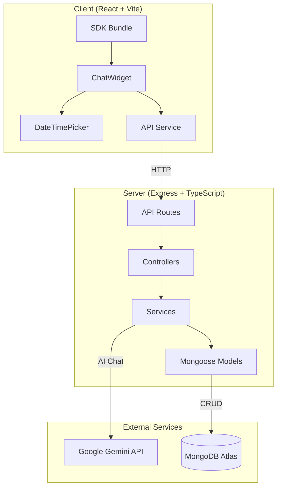
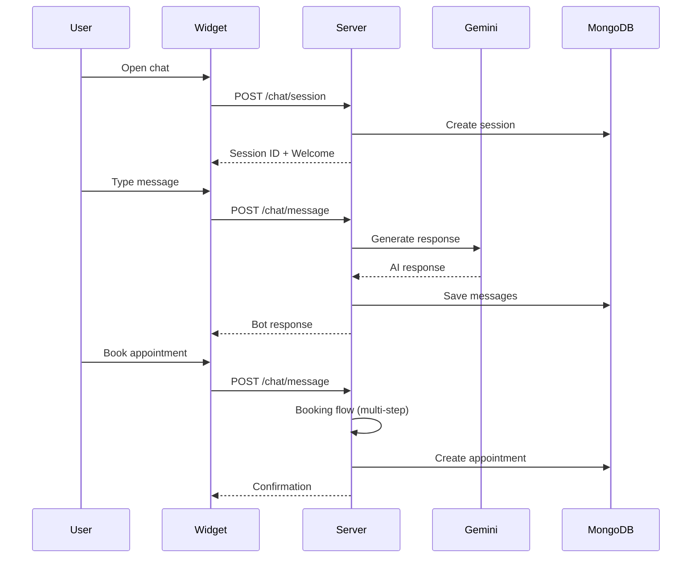
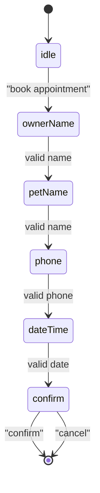

# Veterinary Chatbot SDK - Architecture

## System Overview



## Component Details

### Client Components
| Component | Description |
|-----------|-------------|
| `SDK` | Embeddable script that initializes the chatbot widget |
| `ChatWidget` | Main container with toggle button |
| `ChatWindow` | Message display and input handling |
| `DateTimePicker` | Visual date/time selector for appointments |
| `useChat` | React hook managing chat state and API calls |

### Server Components
| Component | Description |
|-----------|-------------|
| `chatRoutes` | Session and message endpoints |
| `appointmentRoutes` | Appointment CRUD operations |
| `geminiService` | Gemini API integration with vet-specific prompts |
| `appointmentService` | Booking flow state machine |
| `Session` | Chat session with messages and booking state |
| `Appointment` | Appointment data model |

## API Endpoints

### Chat API
```
POST   /api/chat/session     - Create new chat session
POST   /api/chat/message     - Send message, get AI response
GET    /api/chat/history/:id - Get session message history
```

### Appointments API
```
POST   /api/appointments     - Create appointment
GET    /api/appointments     - List all appointments
GET    /api/appointments/:id - Get single appointment
PATCH  /api/appointments/:id - Update appointment status
DELETE /api/appointments/:id - Delete appointment
```

## Data Flow



## Booking State Machine



## Tech Stack

| Layer | Technology |
|-------|------------|
| Frontend | React 18, TypeScript, Vite |
| Backend | Node.js, Express, TypeScript |
| Database | MongoDB Atlas, Mongoose |
| AI | Google Gemini 2.5 Flash |
| Styling | Vanilla CSS (dark theme) |
